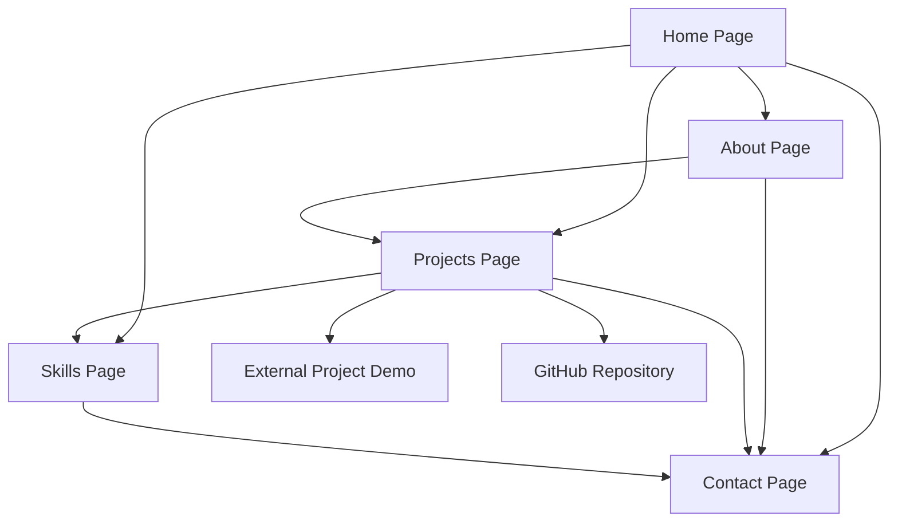

# Modern Portfolio Website - Product Requirements Document

## 1. Product Overview
A modern, responsive portfolio website clone based on Wilson Gayo's existing portfolio, designed as a static site for GitHub Pages deployment. The website will showcase software development expertise with a clean, professional design and enhanced user experience.

The portfolio targets potential clients, employers, and collaborators in the software development industry, providing a comprehensive view of skills, projects, and professional background. The goal is to create a compelling online presence that effectively communicates technical expertise and attracts professional opportunities.

## 2. Core Features

### 2.1 User Roles
No user role distinction is necessary for this portfolio website as it serves as a public showcase.

### 2.2 Feature Module
Our modern portfolio website consists of the following main pages:
1. **Home page**: hero section with introduction, navigation menu, skills overview, featured projects preview.
2. **About page**: detailed professional background, experience timeline, personal story, downloadable resume.
3. **Projects page**: comprehensive project showcase, filtering capabilities, detailed project cards with live demos and source code links.
4. **Skills page**: technical skills categorization, proficiency levels, technology stack visualization.
5. **Contact page**: contact form, social media links, professional networking information.

### 2.3 Page Details

| Page Name | Module Name | Feature description |
|-----------|-------------|---------------------|
| Home page | Hero section | Display professional title, brief introduction, call-to-action buttons for key sections |
| Home page | Navigation menu | Responsive navigation with smooth scrolling, mobile hamburger menu, active section highlighting |
| Home page | Skills overview | Highlight key technical skills with icons, brief descriptions, link to detailed skills page |
| Home page | Featured projects | Showcase 2-3 top projects with images, brief descriptions, links to full project details |
| About page | Professional background | Detailed career summary, current role description, professional philosophy |
| About page | Experience timeline | Chronological work experience, education, certifications with visual timeline |
| About page | Resume download | Downloadable PDF resume, contact information, professional headshot |
| Projects page | Project showcase | Grid layout of all projects with filtering by technology, project type, completion status |
| Projects page | Project details | Individual project cards with descriptions, technologies used, live demo links, GitHub repositories |
| Projects page | Project filtering | Filter and sort projects by technology stack, project type, completion date |
| Skills page | Technical skills | Categorized skill sets (Frontend, Backend, Database, Tools) with proficiency indicators |
| Skills page | Technology stack | Visual representation of current technology preferences, learning roadmap |
| Contact page | Contact form | Functional contact form with validation, email integration, success/error messaging |
| Contact page | Social links | Professional social media profiles, GitHub, LinkedIn, professional networking platforms |
| Contact page | Professional info | Location, availability status, preferred contact methods, response time expectations |

## 3. Core Process

**Visitor Flow:**
Visitors typically start on the home page to get an overview, then navigate to specific sections based on their interest. Potential employers might go directly to projects and skills, while clients may focus on the about section and contact information. The navigation should support both linear browsing and direct access to specific sections.

## 4. User Interface Design

### 4.1 Design Style
- **Primary colors**: Deep blue (#1e40af) and white (#ffffff) for professional appearance
- **Secondary colors**: Light gray (#f8fafc) for backgrounds, accent orange (#f97316) for highlights
- **Button style**: Rounded corners (8px), subtle shadows, hover animations with color transitions
- **Font**: Inter or similar modern sans-serif, 16px base size, clear hierarchy with 24px/32px/48px headings
- **Layout style**: Clean grid-based layout, card components, generous white space, top navigation with sticky behavior
- **Icons**: Lucide React or Heroicons for consistency, technology logos for skills section

### 4.2 Page Design Overview

| Page Name | Module Name | UI Elements |
|-----------|-------------|-------------|
| Home page | Hero section | Full-width background gradient, centered content, large typography (48px), animated call-to-action buttons |
| Home page | Navigation | Sticky header, horizontal menu on desktop, hamburger menu on mobile, smooth scroll behavior |
| Home page | Skills overview | Icon grid layout, hover effects, subtle animations, technology logos with labels |
| Home page | Featured projects | Card-based layout, project thumbnails, overlay text, hover zoom effects |
| About page | Professional background | Two-column layout, professional headshot, text blocks with good typography hierarchy |
| About page | Experience timeline | Vertical timeline with alternating content, date markers, company logos, responsive stacking |
| Projects page | Project showcase | Responsive grid (3 columns desktop, 2 tablet, 1 mobile), filter buttons, search functionality |
| Projects page | Project cards | Image thumbnails, technology badges, description preview, external link buttons |
| Skills page | Technical skills | Categorized sections, progress bars or skill level indicators, technology icons |
| Contact page | Contact form | Clean form design, input validation styling, submit button with loading states |
| Contact page | Social links | Icon buttons with hover effects, consistent spacing, professional color scheme |

### 4.3 Responsiveness
The website is mobile-first responsive design, optimized for touch interactions on mobile devices. Breakpoints at 640px (mobile), 768px (tablet), and 1024px (desktop) ensure optimal viewing across all devices. Navigation transforms to hamburger menu on mobile, grid layouts stack appropriately, and touch targets meet accessibility standards.