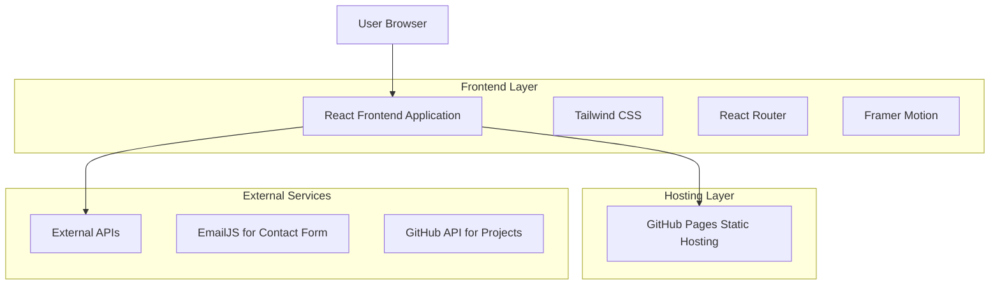
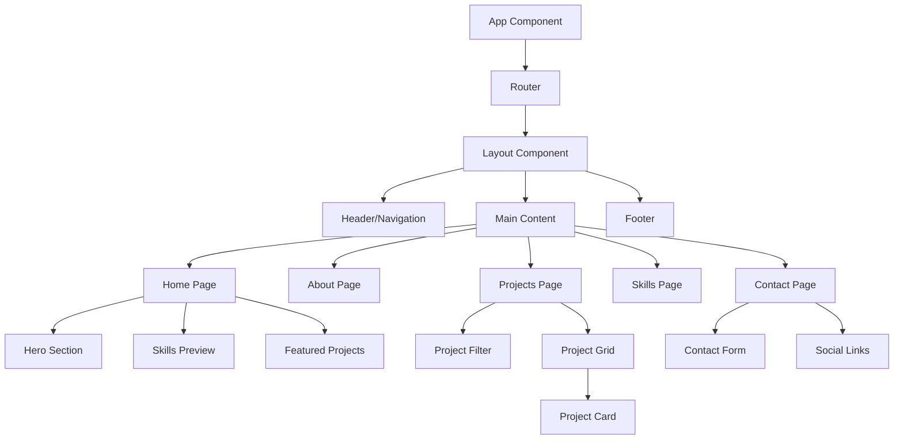

# Modern Portfolio Website - Technical Architecture Document

## 1. Architecture Design



## 2. Technology Description

* **Frontend**: React\@18 + TypeScript + Vite + Tailwind CSS\@3

* **Routing**: React Router DOM\@6

* **Animations**: Framer Motion for smooth transitions

* **Icons**: Lucide React for consistent iconography

* **Form Handling**: React Hook Form with validation

* **Email Service**: EmailJS for contact form functionality

* **Hosting**: GitHub Pages (static hosting)

* **Build Tool**: Vite for fast development and optimized builds

## 3. Route Definitions

| Route     | Purpose                                                             |
| --------- | ------------------------------------------------------------------- |
| /         | Home page with hero section, skills overview, and featured projects |
| /about    | Detailed professional background and experience timeline            |
| /projects | Complete project showcase with filtering capabilities               |
| /skills   | Technical skills categorization and proficiency levels              |
| /contact  | Contact form and professional networking information                |

## 4. API Definitions

### 4.1 External APIs

**EmailJS Contact Form**

```
POST https://api.emailjs.com/api/v1.0/email/send
```

Request:

| Param Name       | Param Type | isRequired | Description                      |
| ---------------- | ---------- | ---------- | -------------------------------- |
| service\_id      | string     | true       | EmailJS service identifier       |
| template\_id     | string     | true       | Email template identifier        |
| user\_id         | string     | true       | EmailJS user public key          |
| template\_params | object     | true       | Form data (name, email, message) |

Response:

| Param Name | Param Type | Description      |
| ---------- | ---------- | ---------------- |
| status     | number     | HTTP status code |
| text       | string     | Response message |

**GitHub API for Projects (Optional)**

```
GET https://api.github.com/users/{username}/repos
```

Response:

| Param Name  | Param Type | Description                  |
| ----------- | ---------- | ---------------------------- |
| name        | string     | Repository name              |
| description | string     | Project description          |
| html\_url   | string     | GitHub repository URL        |
| homepage    | string     | Live demo URL                |
| language    | string     | Primary programming language |
| topics      | array      | Repository topics/tags       |

## 5. Component Architecture



## 6. Data Models

### 6.1 Data Structure Definitions

**Project Interface**

```typescript
interface Project {
  id: string;
  title: string;
  description: string;
  longDescription?: string;
  technologies: string[];
  imageUrl: string;
  demoUrl?: string;
  githubUrl: string;
  featured: boolean;
  category: 'web' | 'mobile' | 'api' | 'tool';
  status: 'completed' | 'in-progress' | 'planned';
  startDate: string;
  endDate?: string;
}
```

**Skill Interface**

```typescript
interface Skill {
  id: string;
  name: string;
  category: 'frontend' | 'backend' | 'database' | 'tools' | 'other';
  proficiency: 1 | 2 | 3 | 4 | 5; // 1-5 scale
  icon?: string;
  description?: string;
}
```

**Contact Form Interface**

```typescript
interface ContactForm {
  name: string;
  email: string;
  subject: string;
  message: string;
}
```

**Experience Interface**

```typescript
interface Experience {
  id: string;
  title: string;
  company: string;
  location: string;
  startDate: string;
  endDate?: string;
  current: boolean;
  description: string[];
  technologies: string[];
}
```

### 6.2 Static Data Files

Since this is a static website, data will be stored in TypeScript/JSON files:

**src/data/projects.ts**

```typescript
export const projects: Project[] = [
  {
    id: 'project-1',
    title: 'E-commerce Platform',
    description: 'Full-stack e-commerce solution with React and Node.js',
    technologies: ['React', 'Node.js', 'MongoDB', 'Express'],
    imageUrl: '/images/projects/ecommerce.jpg',
    githubUrl: 'https://github.com/username/ecommerce',
    featured: true,
    category: 'web',
    status: 'completed',
    startDate: '2024-01-01'
  }
  // ... more projects
];
```

**src/data/skills.ts**

```typescript
export const skills: Skill[] = [
  {
    id: 'react',
    name: 'React',
    category: 'frontend',
    proficiency: 5,
    icon: 'react-icon'
  }
  // ... more skills
];
```

**src/data/experience.ts**

```typescript
export const experience: Experience[] = [
  {
    id: 'current-role',
    title: 'Freelance Software Developer',
    company: 'Self-Employed',
    location: 'Remote',
    startDate: '2023-01-01',
    current: true,
    description: [
      'Develop full-stack web applications and APIs',
      'Implement automated testing solutions',
      'Work with various technologies including Java EE, Angular, Node.js'
    ],
    technologies: ['Java', 'Angular', 'Node.js', 'NestJS', 'TypeScript']
  }
  // ... more experience
];
```

